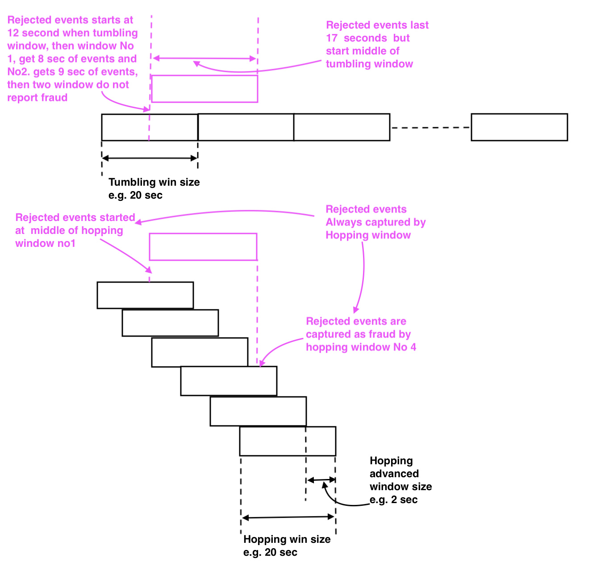
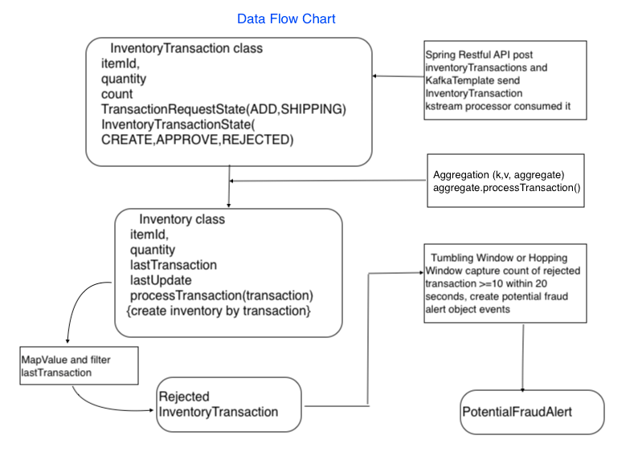
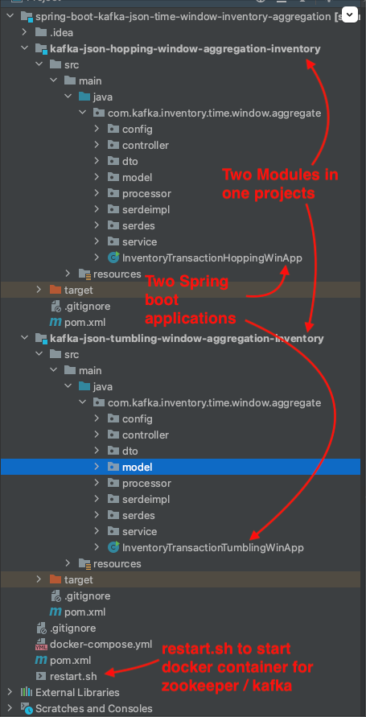
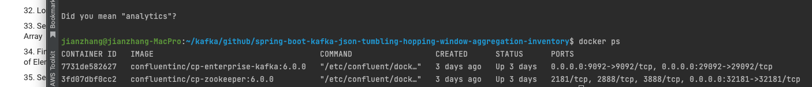
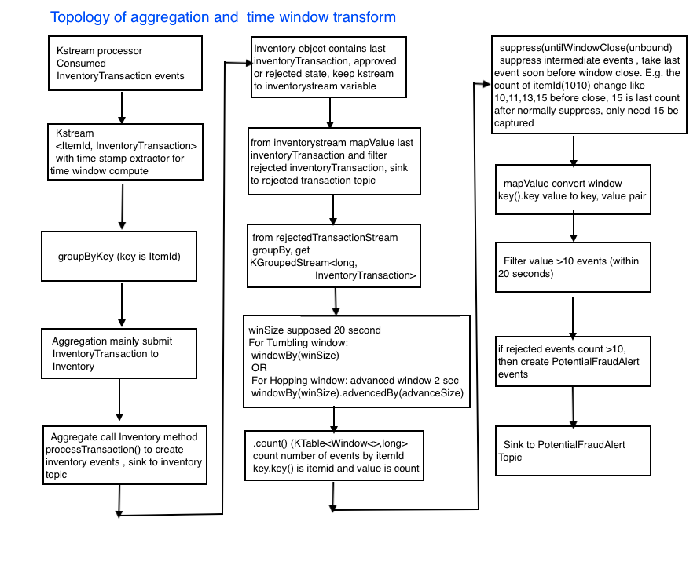
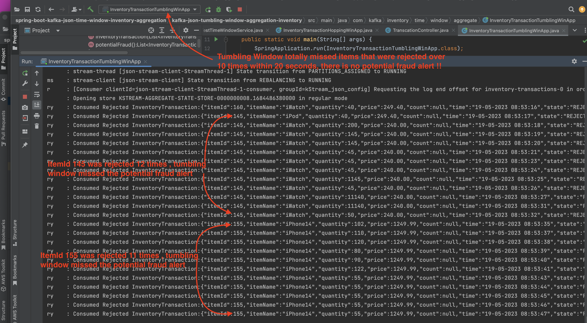
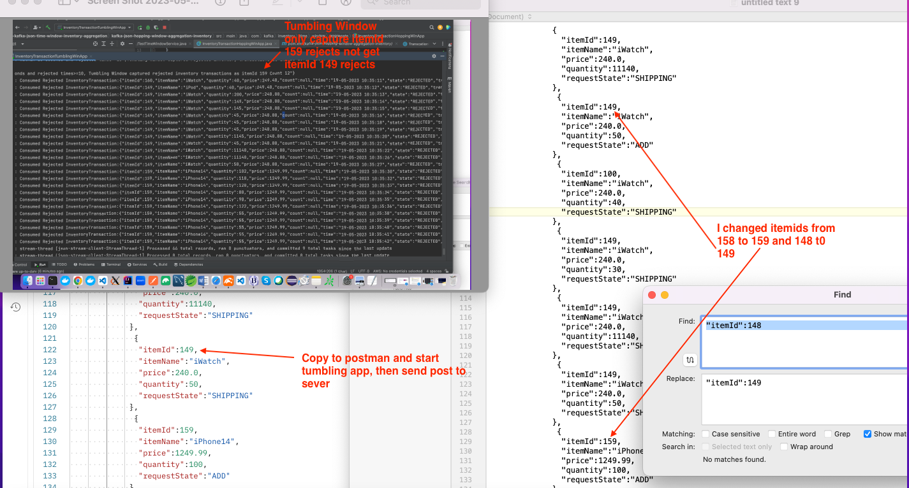
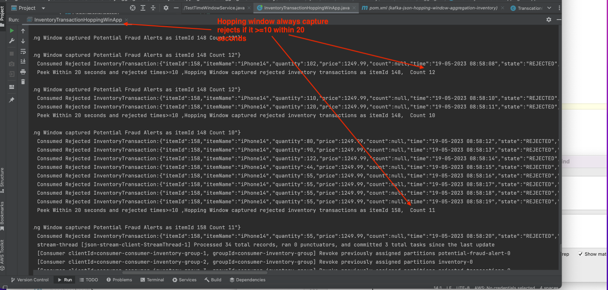
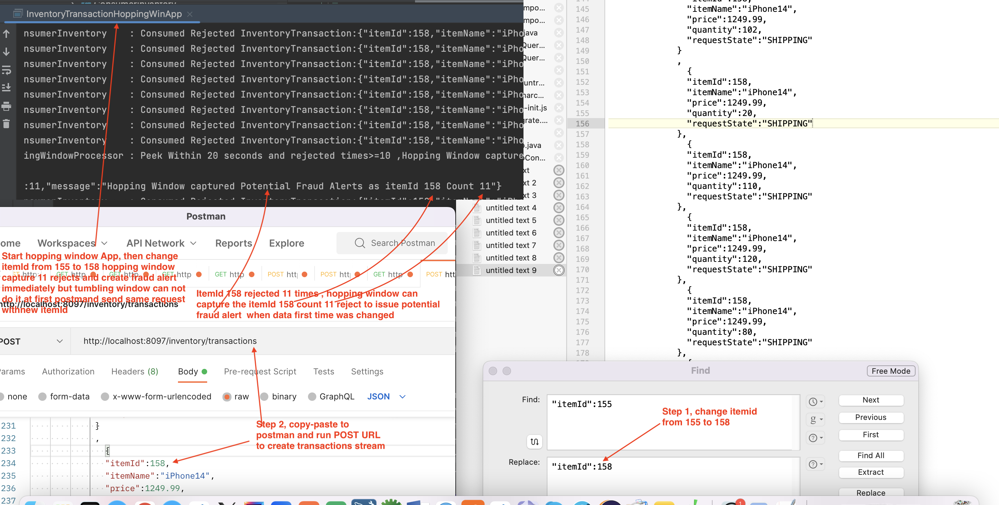

# spring-boot kafka json tumbling & hopping window aggregation for inventory
## Key Points
  1. Implement tumbling and hopping time window to capture specific rejected count based on inventory transaction aggregation 
  2. Comparing two time windows not only by the analysis but also by real tansaction event stream and simulate real conditions 
  3. Inventory transaction include state of "ADD" item to inventory and take item from inventory call "SHIPPING", "APPROVE", 
     "REJECT"
  5. Aggregation transforms inventory transaction into inventory
  6. Supported by Generic Json Serializer and Json Deserializer and Object Serdes, topology and spring boot use same objects 
     without other transform intermediate class such as Avro.
  7. Through many real data tests, we found some important point: when we setup time window to capture events withing 20 
     seconds and rejected count>=10, then create potential fraud alert objects. When rejected events meet this condition, 
     Tumbling Windows either totally not captured or partially captured "fraud" events first time running test data cause 
     different result from next time running.
  8. However using exactly same transform with different window type, Hopping window first time report fraud exactly if they 
     meet fraud condition.
 
     
## Tumbling and Hopping Window Analysis
 
### Tumbling Window

   We already know tumbling window size are fixed and each time go forward fixed size of window length, it detects all events, here 
   we need tumbling window  capture all rejected transaction events if the count >=10 within 20 seconds, therefore if  say rejected 
   events 17 times but across two windows,  first event might start at middle of tumbling window, 8 seconds for example,  even the 
   count =17 and the count <20,  the event count meets fraud alert condition, tumbling window would not capture the count and would 
   not report fraud alert

### Hopping Window

  We know hopping window has the window size and advanced window size, window size is fixed and each time the window forward 
  advanced size. Advance Size is always smaller than window size.  From sampling theory, the sampling density is much more than 
  tumbling window that forward window size.
  For same count of rejected transaction started at about middle (8 seconds) , it always was captured by hopping window
  
  

## Data Flow Chart
  
  
 
  
## System configuration and Settings 
## Project Structure
  We create one project container modules, one module contains hopping window kstream processor and another module is tumbling window
  processor. each modules are mostly same except the kstream processors. 
  Under main project directory (spring-boot-kafka-json-tumbling-hopping-window-aggregation-inventory), we have docker-compose.yml
  and restart.sh, run restart.sh to start docker-container 
  
  
  
    
  
  
## docker-compose.yml

   We need to enphase two points of docker-compose.yml, 
   1. We set KAFKA_ADVERTISED_LISTENERS: PLAINTEXT://localhost:9092, and expose 9092, in our code we alse use thus external same host
      as bootstrap-server because we find spring boot @Kafkalistener of consumer, not care boostrap-server configure, only point 
      localhost:9092, when I use localhost:29092, it issued "127.0.0.1:9092 Node -1, broker connection refused" error message
   2. We need set kafka network explicity name, here is "kafka_same_host_net", otherwise docker compose take current directory
      spring-boot-kafka-json-tumbling-hopping-window-aggregation-inventory-default as network name, when we start similiar docker-
      compose.yml in different diectory name, it complained spring-boot-kafka-json-tumbling-hopping-window-aggregation-inventory-
      default not found , refuse start 
   
            version: '3'
            services:
              zookeeper:
                image: confluentinc/cp-zookeeper:6.0.0
                hostname: zookeeper
                container_name: zookeeper
                ports:
                  - "32181:32181"
                environment:
                  ZOOKEEPER_CLIENT_PORT: 32181
                  ZOOKEEPER_TICK_TIME: 2000
                networks:
                  - kafka_network
              kafka:
                image: confluentinc/cp-enterprise-kafka:6.0.0
                hostname: kafka
                container_name: kafka
                depends_on:
                  - zookeeper
                ports:
                  - "29092:29092"
                  - "9092:9092"
                environment:
                  KAFKA_BROKER_ID: 1
                  KAFKA_ZOOKEEPER_CONNECT: 'zookeeper:32181'
                  KAFKA_LISTENER_SECURITY_PROTOCOL_MAP: PLAINTEXT:PLAINTEXT,PLAINTEXT_HOST:PLAINTEXT
                  KAFKA_ADVERTISED_LISTENERS: PLAINTEXT://localhost:9092,PLAINTEXT_HOST://localhost:29092
                  KAFKA_OFFSETS_TOPIC_REPLICATION_FACTOR: 1
                  KAFKA_GROUP_INITIAL_REBALANCE_DELAY_MS: 0
                  KAFKA_TRANSACTION_STATE_LOG_MIN_ISR: 1
                  KAFKA_TRANSACTION_STATE_LOG_REPLICATION_FACTOR: 1
                networks:
                  - kafka_network

            networks:
              kafka_network:
                name: kafka_same_host_net
                
### Confluent Zookeeper and Kafka Docker Container

  
  
## Data Modeling
   
### InventoryTransaction class
    Two states need us pay attention. First state is TranscationRequestState, If add item to inventory call ADD and take away and 
    ship to customer, call SHIPPING, second InventoryTransactionState, when create a transaction, state is CREATE, when aggregator
    call "processTransaction" , if trnsaction is SHIPPING request state and inventory quantity is not enough, transaction will be 
    "REJECT" state
   
        @Data
        @NoArgsConstructor
        @AllArgsConstructor
        @Builder
        @ToString
        public class InventoryTransaction {

            private Long itemId;
            private String itemName;
            private Long quantity;
            private BigDecimal price = BigDecimal.ZERO;
            private Integer count;

            @JsonFormat(shape = JsonFormat.Shape.STRING,
                        pattern = "dd-MM-yyyy hh:mm:ss")
            public Date time;
            @Builder.Default
            public InventoryTransactionState state = InventoryTransactionState.CREATED;

            public TransactionRequestState transactionRequest;

            public static enum InventoryTransactionState {
                CREATED, APPROVED, REJECTED
            }
            public static enum TransactionRequestState {
                ADD,SHIPPING
            }
        }
    
### Inventory class
   
  In inventory method processTransaction(), it sets current transaction to lastTransaction, and then check if transaction 
  request state is SHIPPING and the quantity > inventory balance quantity then set the inventoryTransactionState as "REJECT"
  if the quantity <= inventory quantity, then inventory quantity minus transaction quantity. if request state is ADD, add anyway
  
  
          @Data
          @AllArgsConstructor
          @Builder
          @ToString
          public class Inventory {

              private Long itemId;
              private String itemName;
              private Long quantity;
              private BigDecimal price = BigDecimal.ZERO;

              @JsonFormat(shape = JsonFormat.Shape.STRING,
                      pattern = "dd-MM-yyyy hh:mm:ss")
              private Date lastUpdate;
              private InventoryTransaction latestTransaction;

              public Inventory() {
                  this.itemId=0l;
                  this.itemName="";
                  this.quantity=0L;
                  this.price = BigDecimal.ZERO;
                  this.latestTransaction=null;

              }
              public Inventory processTransaction(InventoryTransaction inventoryTransaction) {

                   setInventory(inventoryTransaction);

                  if (inventoryTransaction.transactionRequest==InventoryTransaction.TransactionRequestState.SHIPPING) {
                      // shipping item from inventory
                      if (this.quantity < inventoryTransaction.getQuantity()) {
                          this.latestTransaction.setState(InventoryTransaction.InventoryTransactionState.REJECTED);
                      } else {
                          this.latestTransaction.setState(InventoryTransaction.InventoryTransactionState.APPROVED);
                          this.quantity-= inventoryTransaction.getQuantity()==null ? 0:inventoryTransaction.getQuantity();
                      }
                  } else if (inventoryTransaction.transactionRequest==InventoryTransaction.TransactionRequestState.ADD){
                      // add item to inventory
                      this.quantity+=inventoryTransaction.getQuantity()==null ? 0:inventoryTransaction.getQuantity();
                      this.latestTransaction.setState(InventoryTransaction.InventoryTransactionState.APPROVED);
                  }
                  return this;
              }
              public void setInventory(InventoryTransaction transaction) {
                  this.itemId= transaction.getItemId();
                  this.itemName = transaction.getItemName();
                  this.price = transaction.getPrice();
                  this.lastUpdate=transaction.getTime();
                  this.latestTransaction = transaction;
              }
          }
          
### Potential Fraud Alert Class
        @Data
        @NoArgsConstructor
        @AllArgsConstructor
        public class PotentialFraudAlert {
            private Long itemId;
            private Long rejectedTransactionCount;
            private String message;
        }

## Detail Topology of Aggregation & Time Window 

  This part is core of this project. Basic logic is that consumed the transaction event stream, submitted the transaction to
  inventory, filter the rejected transactions and sink to rejected topic, applied time window, within 20 seconds, if rejected 
  transactions count>=10, create potential fraud alert objects and sink to fraud alert topic
  
  Following is detail topology flow
  
  
    
### Topology code as following 
  
### Inventory Hopping window kstream process  

            @EnableKafkaStreams
            @EnableKafka
            @Configuration
            @Slf4j
            public class InventoryHoppingWindowProcessor {

                @Bean
                @DependsOn(KafkaStreamsDefaultConfiguration.DEFAULT_STREAMS_CONFIG_BEAN_NAME)
                public KStream<Long, Inventory> kStream(StreamsBuilder streamsBuilder) {

                    KStream<Long, InventoryTransaction> inventoryTransactionKStream = 
                    streamsBuilder.stream(Constants.INVENTORY_TRANSACTIONS,
                            Consumed.with(Serdes.Long(), InventoryTransactionSerdes.serdes())
                                    .withTimestampExtractor(new TransactionTimeExtractor()));

                    KStream<Long, Inventory> inventoryKStream =
                            inventoryTransactionKStream.groupByKey()
                                    .aggregate(()->new Inventory(),
                                            (key, value, aggregate) -> {
                                                aggregate.processTransaction(value);
                                                return aggregate;
                                            },
                                            Materialized.with(Serdes.Long(), InventorySerdes.serdes())
                                    )
                                    .toStream();
    
                    inventoryKStream.to(Constants.INVENTORY, Produced.with(Serdes.Long(), InventorySerdes.serdes()));

                    KStream<Long, InventoryTransaction> rejectedTransactionStream = inventoryKStream
                            .mapValues((readOnlyKey,value)->value.getLatestTransaction())
                            .filter((kay,value)->value.state== InventoryTransaction.InventoryTransactionState.REJECTED);

                    rejectedTransactionStream
                            .to(Constants.REJECTED_TRANSACTIONS, Produced.with(Serdes.Long(), 
                            InventoryTransactionSerdes.serdes()));

                    Duration hoppingWindowSize = Duration.ofSeconds(20L);
                    Duration advanceWindowSize = Duration.ofSeconds(2L);
                    rejectedTransactionStream
                            .groupByKey()
                            .windowedBy(TimeWindows.of(hoppingWindowSize).advanceBy(advanceWindowSize).grace(Duration.ofSeconds(0)))
                            .count()
                            .suppress(untilWindowCloses(unbounded()))
                            .toStream()
                            .map((key,value)-> KeyValue.pair(key.key(),value))
                             .filter((key,value)->value>=10)
                            .peek(((key,value)->log.info("Peek Within 20 seconds and rejected times>=10 ,Hopping Window captured 
                            rejected inventory transactions as itemId {},  Count {}",key,value)))
                            .mapValues((key,value)->new PotentialFraudAlert(key,value,String.format("Hopping Window captured Potential 
                            Fraud Alerts as itemId %s Count %d",key,value)))
                            .to(Constants.POTENTIAL_FRAUD_ALERT,Produced.with(Serdes.Long(), PotentialFraudAlertSerdes.serdes()));
                    return inventoryKStream;
                }
            }
  
### Inventory Tumbling window kstream processor

   
   Ignore same parts as hopping window, only show time window code section as following 
   
   
   ...........
   
                 Duration tumblingWindowSize = Duration.ofSeconds(20L);
                rejectedTransactionStream
                        .groupByKey()
                        // tumbling window setting 20 second and grace means consider latency of system or network
                        .windowedBy(TimeWindows.of(tumblingWindowSize).grace(Duration.ofSeconds(0)))
                        .count()
                        .suppress(untilWindowCloses(unbounded()))
                        .toStream()
                        .map((key,value)-> KeyValue.pair(key.key(),value))
                        .filter((key,value)->value>=10)
                        .peek(((key,value)->log.info("Within 20 seconds and rejected times>=10 ,Tumbling Window captured rejected 
                        inventory transactions as itemId {},  Count {}",key,value)))
                        .mapValues((key,value)->new PotentialFraudAlert(key,value,String.format("Within 20 seconds and rejected 
                        times>=10, Tumbling Window captured rejected inventory transactions as itemId %s Count %d",key,value)))
                        .to(Constants.POTENTIAL_FRAUD_ALERT,Produced.with(Serdes.Long(), PotentialFraudAlertSerdes.serdes()));

              return inventoryKStream;
          }
  
## Inventory Transaction Service for Restful API

   We map inventoryTransactionDto to inventoryTransaction, here round 2 decimals of Double price wben convert Double to BigDecimal
   price. 
   
              @Service
              public class InventoryTransactionService {
                  public InventoryTransaction toInventoryTransaction(InventoryTransactionDto inventoryTransactionDto) {
                      InventoryTransaction.TransactionRequestState requestState;
                      if (inventoryTransactionDto.requestState.equalsIgnoreCase("ADD")) {
                          requestState = InventoryTransaction.TransactionRequestState.ADD;
                      } else if (inventoryTransactionDto.requestState.equalsIgnoreCase("SHIPPING")) {
                          requestState = InventoryTransaction.TransactionRequestState.SHIPPING;
                      } else {
                          throw new RuntimeException("must specify request state \"Add\" or \"SHOPPING\"");
                      }
                      if (inventoryTransactionDto.getPrice() == null) {
                          throw new RuntimeException("Price is required!");
                      }
                      if (inventoryTransactionDto.getQuantity() == null) {
                          throw new RuntimeException("Quantity is required!");
                      }
                      // keep two decimals only
                      BigDecimal price = new BigDecimal(inventoryTransactionDto.getPrice());
                      price = price.setScale(2, BigDecimal.ROUND_HALF_EVEN);
                      InventoryTransaction InventoryTransaction = 
                      com.kafka.inventory.time.window.aggregate.model.InventoryTransaction.builder()
                              .itemId(inventoryTransactionDto.getItemId())
                              .transactionRequest(requestState)
                              .price(price)
                              .quantity(Long.valueOf(inventoryTransactionDto.getQuantity()))
                              .itemName(inventoryTransactionDto.getItemName())
                              .time(new Date())
                              .build();
                      return InventoryTransaction;
                  }
              }
              
### InventoryTransactionDto 

          @Data
          @NoArgsConstructor
          @AllArgsConstructor
          @Builder
          public class InventoryTransactionDto {
              private Long itemId;
              private String itemName;
              private Long quantity;
              private Double price;
              public String requestState;
          }
          
### Simulating 105 rejected transcation service

            @Service
            public class TestTimeWindowService {

                public List<InventoryTransaction> testTumblingWindowFraud() {
                    int times = 105; ;   //   105 times rejected Transactions
                    BigDecimal price = new BigDecimal(239.99);
                    price = price.setScale(2, BigDecimal.ROUND_HALF_EVEN);
                    List<InventoryTransaction> list = new ArrayList<>();
                    for (int i = 0; i<times;i++) {
                        InventoryTransaction inventoryTransaction= InventoryTransaction.builder()
                                .itemId(10021L)
                                .count(i+1)
                                .price(price)
                                .transactionRequest(InventoryTransaction.TransactionRequestState.SHIPPING)
                                .quantity((long) (2000+Math.random()*1000))
                                .itemName("iWatch")
                                .time(new Date())
                                .build();
                        list.add( inventoryTransaction);
                    }
                    return list;
                }
            }
            
## Restful API and test data    

   Below important point is that before we send bunch of inventoryTransaction, we make 1 second sleep, simulate send transaction once   
   per second, means that we send more ten of transactions within 20 seconds , which expects to be captured by 20 second time window
   
                @RestController
                @RequestMapping("/inventory")
                @RequiredArgsConstructor
                public class TranscationController {

                    private final SendInventoryTransaction sendInventoryTransaction;
                    private final InventoryTransactionService inventoryTransactionService;
                    private final TestTimeWindowService testTimeWindowService;
                    
                    @PostMapping("/transaction")
                    public InventoryTransaction InventoryTransaction(@RequestBody InventoryTransactionDto inventoryTransactionDto) {
                        InventoryTransaction inventoryTransaction = 
                        inventoryTransactionService.toInventoryTransaction(inventoryTransactionDto);
                        sendInventoryTransaction.SendInventoryTransaction(inventoryTransaction);
                        return inventoryTransaction;
                    }

                    @PostMapping("/transactions")
                    public List<InventoryTransactionDto> InventoryTransaction(@RequestBody List<InventoryTransactionDto> 
                    inventoryTransactionDtos) {
                        inventoryTransactionDtos.forEach(inventoryTransactionDto -> {
                            try {
                                Thread.sleep(1000);
                            } catch (InterruptedException e) {
                            }
                            InventoryTransaction inventoryTransaction = 
                            inventoryTransactionService.toInventoryTransaction(inventoryTransactionDto);
                            sendInventoryTransaction.SendInventoryTransaction(inventoryTransaction);
                        });
                        return inventoryTransactionDtos;
                    }

                    @GetMapping("/potentialFraud")
                    public List<InventoryTransaction> potentialFraud() {
                        List<InventoryTransaction> inventoryTransactions = testTimeWindowService.testTumblingWindowFraud();
                        inventoryTransactions.forEach(inventoryTransaction -> {
                            try {
                                Thread.sleep(1000);
                            } catch (InterruptedException e) {}

                            sendInventoryTransaction.SendInventoryTransaction(inventoryTransaction);
                          });
                        return inventoryTransactions;
                    }
                }

### TestData.txt

   under main directory: spring-boot-kafka-json-tumbling-hopping-window-aggregation-inventory
   we have TestData.text, can run about Rest API in Postman. http://localhost:8097/inventory/dataProducer
   we call the simulating test to generate 105 rejected transaction, in http://localhost:8097/inventory/transactions
   we post to hopping window and tumbling window to do comparison tests
   
   
              Postman test data
                GET
                http://localhost:8097/inventory/dataProducer

                POST
                http://localhost:8097/inventory/transaction
                {
                    "itemId":100,
                    "itemName":"iWatch",
                    "price":250.0
                    "quantity":1200,
                    "requestState":"ADD"
                 }

                 POST
                       http://localhost:8097/inventory/transactions
                 Body

              [
                     {
                         "itemId":145,
                         "itemName":"iWatch",
                         "quantity":40,
                         "price":249.4,
                         "requestState":"ADD"
                      },
                     {
                        "itemId":145,
                         "itemName":"iWatch",
                         "price":240.0,
                         "quantity":200,
                         "requestState":"SHIPPING"
                      },
                      {
                         "itemId":145,
                         "itemName":"iWatch",
                         "price":240.0,
                         "quantity":45,
                         "requestState":"SHIPPING"
                     },
                       {
                         "itemId":145,
                         "itemName":"iWatch",
                         "price":240.0,
                         "quantity":40,
                         "requestState":"SHIPPING"
                       },
                        {
                         "itemId":145,
                         "itemName":"iWatch",
                         "price":240.0,
                         "quantity":50,
                         "requestState":"ADD"
                       },
                        {
                         "itemId":145,
                         "itemName":"iWatch",
                         "price":240.0,
                         "quantity":40,
                         "requestState":"SHIPPING"
                       },
                        {
                         "itemId":145,
                         "itemName":"iWatch",
                         "price":240.0,
                         "quantity":30,
                         "requestState":"SHIPPING"
                       },
                        {
                         "itemId":145,
                         "itemName":"iWatch",
                         "price":240.0,
                         "quantity":140,
                         "requestState":"SHIPPING"
                       },
                        {
                         "itemId":145,
                         "itemName":"iWatch",
                         "price":240.0,
                         "quantity":50,
                         "requestState":"SHIPPING"
                       },
                        {
                         "itemId":155,
                         "itemName":"iPhone14",
                         "price":1249.99,
                         "quantity":100,
                         "requestState":"SHIPPING"
                       },
                         {
                         "itemId":155,
                         "itemName":"iPhone14",
                         "price":1249.99,
                         "quantity":50,
                         "requestState":"SHIPPING"
                       }
                       ,
                         {
                         "itemId":155,
                         "itemName":"iPhone14",
                         "price":1249.99,
                         "quantity":102,
                         "requestState":"SHIPPING"
                       }
                       ,
                         {
                         "itemId":155,
                         "itemName":"iPhone14",
                         "price":1249.99,
                         "quantity":20,
                         "requestState":"SHIPPING"
                       },
                         {
                         "itemId":155,
                         "itemName":"iPhone14",
                         "price":1249.99,
                         "quantity":110,
                         "requestState":"SHIPPING"
                       },
                         {
                         "itemId":155,
                         "itemName":"iPhone14",
                         "price":1249.99,
                         "quantity":120,
                         "requestState":"SHIPPING"
                       },
                         {
                         "itemId":155,
                         "itemName":"iPhone14",
                         "price":1249.99,
                         "quantity":80,
                         "requestState":"SHIPPING"
                       },
                         {
                         "itemId":155,
                         "itemName":"iPhone14",
                         "price":1249.99,
                         "quantity":90,
                         "requestState":"SHIPPING"
                       },
                         {
                         "itemId":155,
                         "itemName":"iPhone14",
                         "price":1249.99,
                         "quantity":122,
                         "requestState":"SHIPPING"
                       },
                         {
                         "itemId":155,
                         "itemName":"iPhone14",
                         "price":1249.99,
                         "quantity":44,
                         "requestState":"SHIPPING"
                       }
                       ,
                         {
                         "itemId":155,
                         "itemName":"iPhone14",
                         "price":1249.99,
                         "quantity":55,
                         "requestState":"SHIPPING"
                       }
                   ]
                   
## Test Result:
  
### Tumbling Window missed or partially rejected transactions fraud alert when the count >=10  within 20 seconds

   Reproduce this case:
   Run InventoryTransactionTumblingWinApp --> post http://localhost:8097/inventory/transactions and copy below data tp body --> waiting 
   20 seconds--> itemId 145 was rejected 12 times and itemId 155 was rejected 11 times --> but tumbling window missed fraud alert at 
   all as following 
   
     
   
   Runing second time tumbling window captured item 159 and missed 149
   
   
   
### Hopping Window correctly capture rejected transactions fraud alert at first time
  
     

   even I changed the itemIds, It captured changed itemids meet fraud alert condition
   
     
   
### You can test following URL to running 105 rejected transactions 
 GET
    http://localhost:8097/inventory/dataProducer
    
## Conclusion

  Through testing and analysis, hopping Window are much stable to capture particular events than tumbling window, this project
  privide USE CASE for Transaction Event real time stream tranform by time window based on the transaction aggregation, it may
  be applied to password check or bank fraud check etc as my wish

## Detail information as below link

  [spring-boot kafka json tumbling & hopping window aggregation for inventory/](https://johnzhang320.com/spring-boot-kafka-json-tumbling-and-hopping-window-aggregation-for-inventory/)
 
  
 ## My Kafka Related Links
 
  [spring-boot-kafka-json-stateful-aggregation/](https://johnzhang320.com/spring-boot-kafka-json-stateful-aggregation)
  
  [spring-boot kafka json stream/](https://johnzhang320.com/spring-boot-kafka-json-stream)
  
  [Spring boot connects to AWS EC2 Kafka docker container/](https://johnzhang320.com/kafka-aws-ec2-kafka-docker/)
  
  [Spring-boot kafka event driven/](https://johnzhang320.com/spring-boot-kafka-event-driven)
 
  [Spring-boot kafka stream sorted unique word count/](https://johnzhang320.com/sorted-unique-word-count/)
 
  
   

